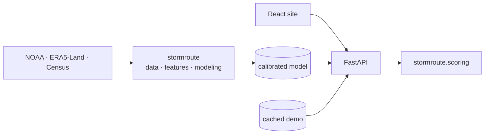

# StormRoute

**A prototype being developed to help North Carolina travelers compare routes
and departure times by modeled flood-hazard exposure.**

> **Project status: data ingestion and sample EDA development; EDA gate pending.**
> Census boundaries are verified, and analysis code runs on synthetic event
> fixtures. Full-data findings, a trained model, and application behavior remain
> unverified. **EDA is the first scientific milestone.** Modeling waits for gate approval.
> See [the build guide](docs/build_guide.md).

Carolina Data Challenge 2026 · Natural Science Track · AI for Social Good

---

## 1. Intended behavior

The planned application accepts an origin, destination, and departure time to:

1. give the trip a **0–100 Weather Safety Score**, which is a comparative index of
   modeled flood-hazard exposure;
2. show **which part of the route** contributes the most exposure, and when you
   would be there;
3. recommend a **route or departure-time change** that improves the score; and
4. show the **trade-off**: score before and after, plus the added travel time.

> **Leave four hours later: 54 → 81 (+27).** This avoids the peak modeled
> flood-hazard window in Haywood County without increasing drive time.
> *(illustrative; not a model result)*

## 2. Screenshot

_TBD (Milestone 7)._

## 3. Why

The project focuses on decisions made before a trip: comparing *this route, now*
with *that route, later*. Its intended contribution is to explain differences in
modeled exposure alongside forecasts and official alerts. Reduced real-world
exposure or harm has not been demonstrated.

## 4. Planned capabilities

- Trip-level score with a plain-language band. The top band is never called "safe".
- Worst-segment explanation at county × six-hour resolution.
- Counterfactual recommendations across alternate routes and departures up to
  12 hours out.
- Official NWS alerts shown **above** the model. Alerts can raise risk and never
  lower it.
- Cached replay of Hurricane Helene that runs with the network off.

## 5. Architecture



Details are in [docs/architecture.md](docs/architecture.md).

## 6. Data and model

The following is the planned design, not a trained or evaluated model.

| | |
|---|---|
| Unit | North Carolina county × six-hour window, 2015–2024 |
| Label | ≥ 1 Flood, Flash Flood, or Debris Flow event begins in the window |
| Features | Rolling precipitation, soil moisture, temperature, wind, terrain, season |
| Model | Monotonic gradient-boosted trees, sigmoid-calibrated |
| Baselines | County-month climatology · logistic regression |
| Splits | Train 2015–21 · select 2022 · calibrate 2023 · **test 2024** |

[Data card](docs/data_card.md) · [Model card](docs/model_card.md) ·
[Risk methodology](docs/risk_methodology.md)

## 7. Results

_TBD (Milestone 4)._ No result will be quoted until the single final evaluation
on untouched 2024 data is complete.

## 8. Quick start

In a **GitHub Codespace**, `make setup` runs automatically. Locally, you need
Python 3.11, Node 20, `uv`, and GDAL.

```bash
make setup          # Install Python, notebook, and frontend dependencies
make download       # Download/version required source data          (Milestone 1)
make eda            # Execute the EDA notebook from top to bottom     (Milestone 2)
make data           # Build the production county-window table        (Milestone 3)
make train          # Train baselines and the candidate final model   (Milestone 4)
make evaluate       # Evaluate and export final metrics/figures       (Milestone 4)
make api            # Start FastAPI on port 8000                      (Milestone 6)
make web            # Start Vite on port 5173                         (Milestone 7)
make test           # Run Python and frontend tests
make lint           # Run formatters, linters, and type checks
make verify         # Run the complete repository verification suite
make demo-cache     # Rebuild the offline presentation scenario       (Milestone 5)
```

Targets for later milestones exit with an explanation instead of doing nothing.
Run `make help` to list them.

## 9. Demo

_TBD (Milestone 9)._ See [docs/demo_runbook.md](docs/demo_runbook.md).

## 10. Repository structure

```text
configs/          Locked definitions: data, model, scoring, demo
data/             raw → interim → processed (ignored) · sample fixtures (tracked)
notebooks/        01 EDA gate · 02 feature validation · 03 model evaluation
src/stormroute/   data · features · modeling · routing · scoring
scripts/          One entry point per Makefile target
backend/          FastAPI service (transport only; no scoring logic)
frontend/         React + TypeScript + Vite website
tests/            data · modeling · routing · scoring
outputs/          Final figures and metrics
artifacts/        Model manifest · cached demo scenario
reports/eda/      Written EDA findings and gate decision
docs/             Specification, build guide, cards, methodology, ADRs
```

## 11. Limitations and safety

StormRoute is a **decision-support prototype**. It is not a navigation system, a
crash predictor, or a guarantee of safety.

- No reported event does not prove safe road conditions.
- County resolution cannot identify whether a particular road is flooded.
- The model is not a crash predictor.
- Evaluation uses retrospective reanalysis, which differs from live forecasts.
- Recommendations never override road closures, evacuation orders, or NWS guidance.
- Demographic or vulnerability data never change an individual trip score.

**In an emergency, follow official guidance at [weather.gov](https://www.weather.gov)
and from local authorities. Turn around, don't drown.**

More detail is in [docs/responsible_ai.md](docs/responsible_ai.md).

## 12. Team

| Role | Owns |
|---|---|
| Mason, product and AI lead | NOAA ingestion, labels, model, scoring, narrative |
| _TBD_, CS major, geospatial and web lead | Repository, routing, API, website, demo reliability |
| _TBD_, Econ/Stats major, evaluation and impact lead | Data quality, evaluation, responsible AI, DevPost |

How we work is described in [CONTRIBUTING.md](CONTRIBUTING.md).

## 13. Data citations and license

Code: [MIT](LICENSE). Data sources keep their own terms:

- NOAA NCEI Storm Events Database (public domain)
- Copernicus ERA5-Land (Copernicus Licence, attribution required)
- U.S. Census Bureau TIGER/Line 2024 (public domain)
- National Weather Service API (public domain)
- Route data © OpenStreetMap contributors, ODbL

The full list is in [docs/references.md](docs/references.md) and
[data/data_manifest.yaml](data/data_manifest.yaml).
