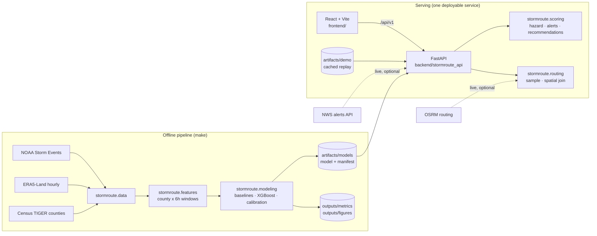

# Architecture

> Target architecture. Nothing below is built yet; each box is filled at the
> milestone shown.

## System overview

## Request flow — `POST /api/v1/trips/score`

1. Validate the request (coordinates inside NC, timezone-aware departure).
2. Get 2–3 candidate routes — live OSRM, or cached replay.
3. Sample each route every 5–10 km and at county boundaries; compute arrival time.
4. Map samples to (county, six-hour window) intervals; flag uncovered portions.
5. Look up calibrated probabilities for each interval.
6. Aggregate to trip risk; apply the official-alert floor.
7. Repeat for departures +2 … +12 h; rank alternatives.
8. Return score, band, worst segment, factors, alerts, alternatives,
   recommendation, confidence, and limitations — with model and data versions.

## Boundaries

| Layer | Owns | Must not |
|---|---|---|
| `stormroute` package | All data, modeling, and scoring logic | Know about HTTP |
| `stormroute_api` | Validation, versioning, caching, errors, logging | Reimplement any formula |
| `frontend` | Presentation, accessibility, state handling | Compute a score |

## Deployment

The React build is served as static files by FastAPI: one service, one public
URL. The demo runs in cached-replay mode with no external dependency.
_Hosting target: TBD (Milestone 9)._

## Key decisions

- [ADR 0000 — Specification precedence](adr/0000-specification-precedence.md)
- [ADR 0001 — County × six-hour target](adr/0001-county-six-hour-target.md)
- [ADR 0002 — Calibrated monotonic boosted model](adr/0002-calibrated-boosted-model.md)
- [ADR 0003 — Reanalysis vs live forecast](adr/0003-reanalysis-live-forecast-boundary.md)
